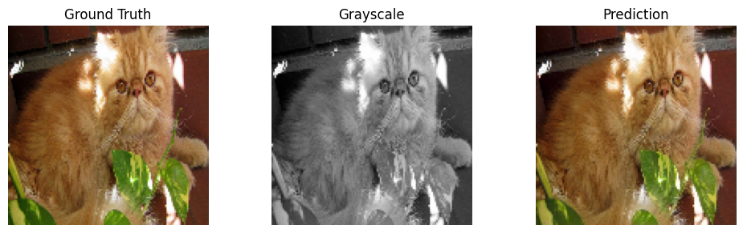

# Pet Image Colorization in LAB Space

This project is my EE541 final project: automatic colorization of pet images
using the Oxford-IIIT Pet dataset and neural networks in the LAB color space.

## Models

- Baseline CNN encoder–decoder
- U-Net from scratch
- U-Net with VGG16 encoder (pretrained on ImageNet)

All models take the L channel (grayscale) and predict the ab channels, which
are converted back to RGB via OpenCV's LAB↔RGB conversion.

## Results

- Baseline: PSNR ~23.9, SSIM ~0.93 (low-saturation, sepia-ish reconstructions)
- U-Net: PSNR ~24.0, SSIM ~0.93 (low-saturation, sepia-ish reconstructions)
- VGG-UNet: PSNR ~36.23, SSIM ~0.98 (very close approximation)



## Data

Dataset: [Oxford-IIIT Pet Dataset](https://www.robots.ox.ac.uk/~vgg/data/pets/)

Download the images and place them under:

`data/oxford-iiit-pet/images/`

The notebook assumes this directory structure.

## Usage

1. Install dependencies:

   ```bash
   pip install -r requirements.txt

